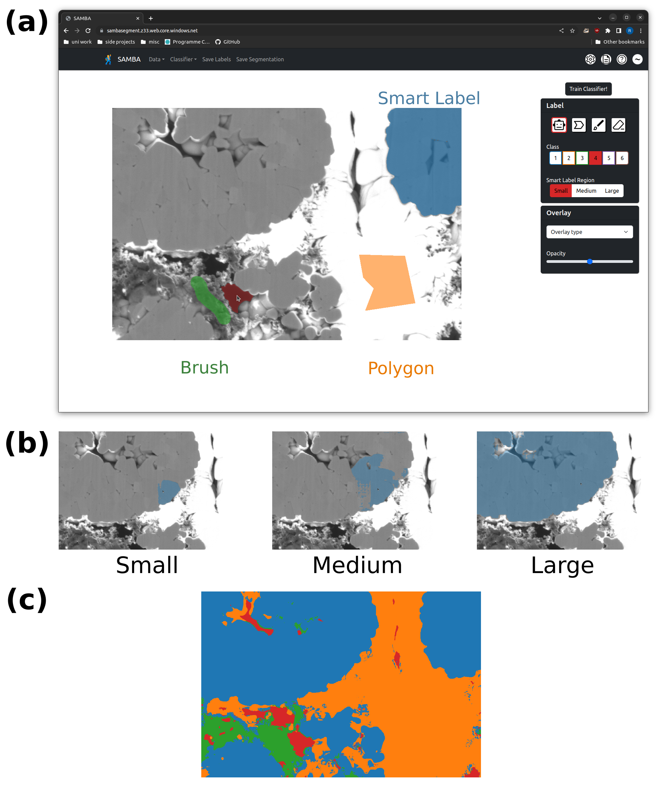

## Segment Anything Model Based App (SAMBA) - web demo


`SAMBA` is a trainable segmentation tool for materials science that uses [deep learning](https://github.com/facebookresearch/segment-anything) for fast, high-quality labels and random forests for robust, generalizable segmentations. It is accessible in the browser ([https://sambasegment.com](https://sambasegment.z33.web.core.windows.net/)), without the need to download any external dependencies. This repo is a local version of the website which contains the frontend for the website (React + TSX) and the backend (Python + Flask). The frontend handles labelling and the backend sends back SAM embeddings (if requested) and segmentations.


## Local Installation Instructions
These instructions are for installing and running the model locally. They assume a UNIX enviroment (mac or linux), but adapting for Windows is straightforward. Note you will need 2 terminals, one for the frontend local server and one for the backend local server.
### Preliminaries
Download one of the ViT checkpoints for the SAM model - I choose the smallest, `vit_b`: [ViT-B SAM model.](https://dl.fbaipublicfiles.com/segment_anything/sam_vit_b_01ec64.pth)

### Install & run the backend
0. Setup a [virtual environment in Python](https://docs.python.org/3/library/venv.html) and activate it (not necessary but recommended)
1. Install libraries from `backend/requirements.txt`:
```
pip install -r backend/requirements.txt
```
2. With your virtual environment activated and inside the `backend/` directory, run
```
python -m flask --app server run
```
The server is now setup and listening for requests from our frontend!

### Install & run the frontend
0. Install the JS libraries needed to build and run the frontend. Install Yarn (and npm first if needed)
```
npm install --g yarn
```
1. Build and run:
```
yarn && yarn start
```
2. Navigate to [`http://localhost:8081/`](http://localhost:8081/) or [`http://localhost:8080/`](http://localhost:8080/) depending on the port (it should do this automatically).

## Testing Instructions
1. Run (with your virtual enviroment activated!)
```
python backend/tests.py $FIJI_PATH
```
where `$FIJI_PATH` is the absolute path to your [FIJI](https://imagej.net/software/fiji/) installation.